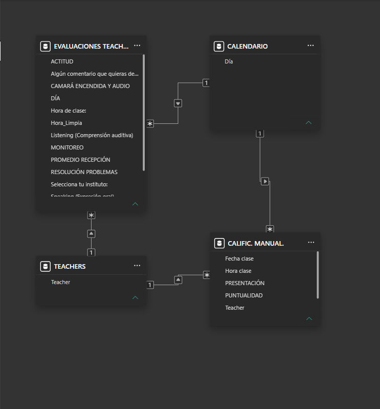
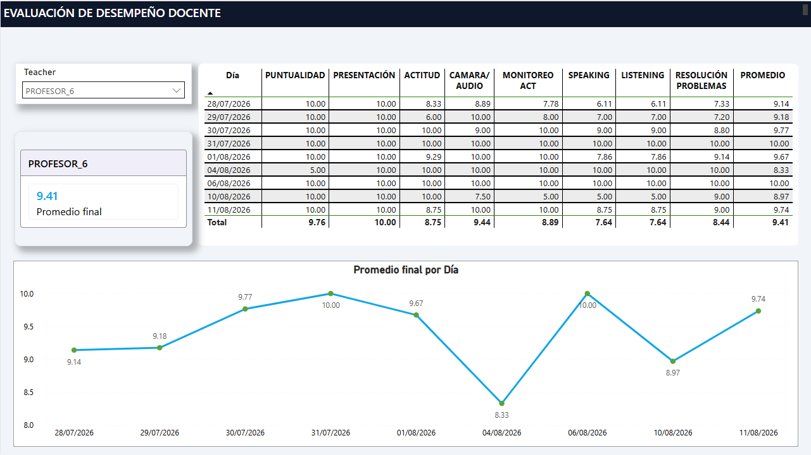
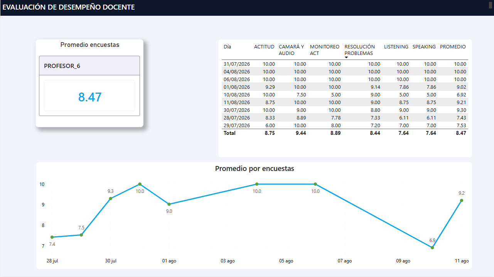
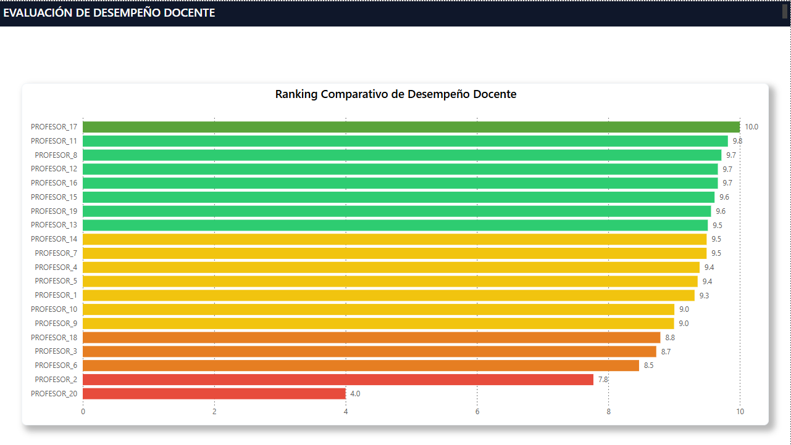
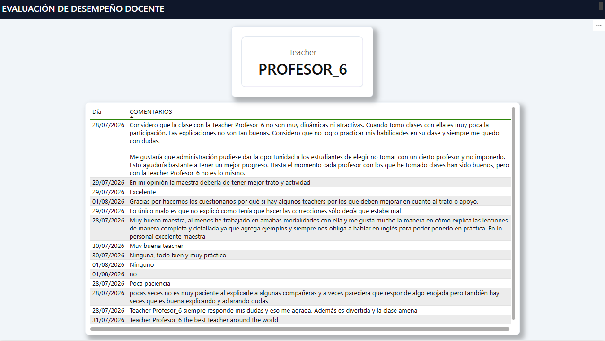
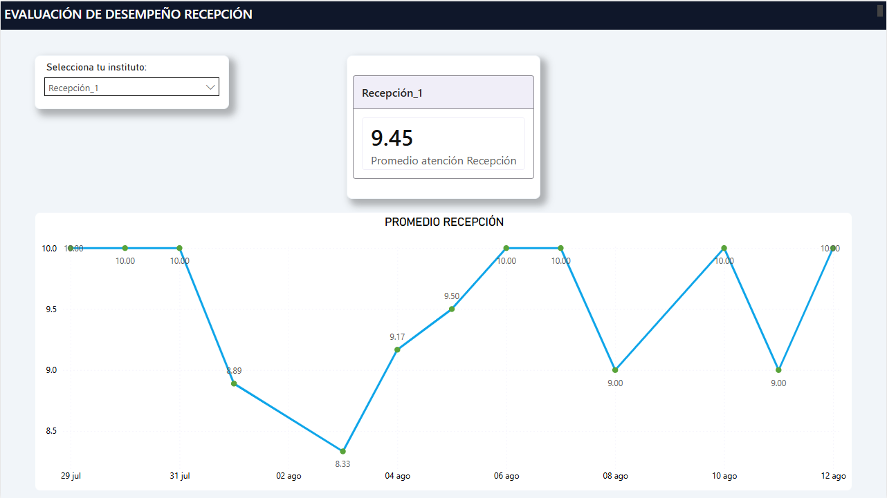
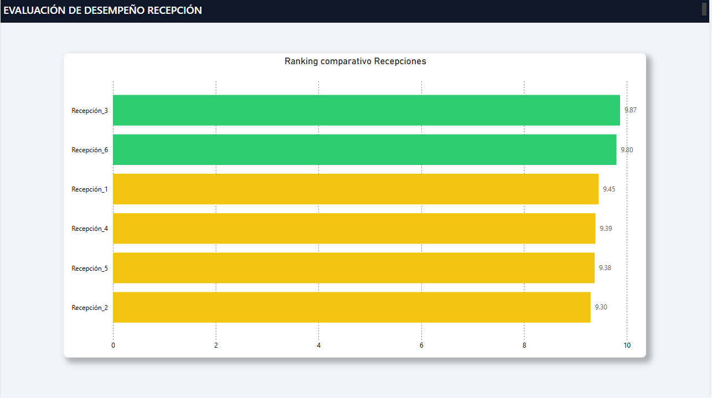
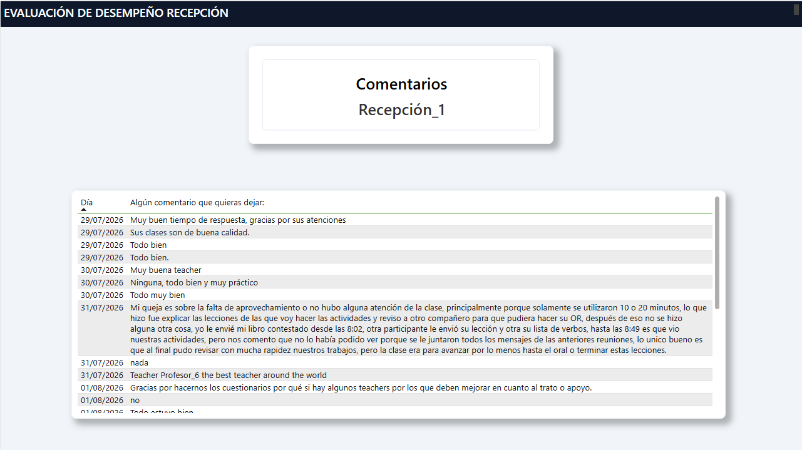

# 📊 Dashboard de Evaluación de Desempeño Docente y Recepción | Power BI


Solución analítica integral de **Business Intelligence de extremo a extremo** desarrollada en Power BI. El proyecto consolida el monitoreo cuantitativo, la evaluación cualitativa y el análisis comparativo del desempeño docente y la atención operativa en recepción.

---

## 🔒 Nota de Privacidad y Anonimización

Para garantizar la confidencialidad institucional y la protección de datos personales:
* **Proceso ETL en Power Query:** Se realizó la limpieza y estandarización eliminando caracteres especiales, tildes y datos de identificación sensible.
* **Anonimización Relacional:** Nombres de profesores y sedes/institutos fueron reemplazados por identificadores genéricos (*PROFESOR_1*, *PROFESOR_2*, etc.), manteniendo intacta la precisión matemática y la integridad de las relaciones del modelo.

---

## 🏗️ Arquitectura de Datos y Modelado

El proyecto implementa un **Esquema en Estrella con Múltiples Tablas de Hechos (Fact Constellation Schema)**, garantizando propagación de filtros eficiente, relaciones unidireccionales de $1:*$ y un rendimiento óptimo en el motor VertiPaq:



### 1. Tablas de Dimensión (Dimension Tables)
* **`TEACHERS`**: Entidad maestra de docentes (`Teacher`). Actúa como filtro primario de $1:*$ hacia ambas tablas transaccionales.
* **`CALENDARIO`**: Dimensión temporal continua (`Día`) que conecta con las fechas de evaluación para habilitar inteligencia de tiempo e interacciones temporales coherentes.

### 2. Tablas de Hechos (Fact Tables)
* **`EVALUACIONES TEACHERS`**: Registra los datos de encuestas directas de alumnos (*Actitud, Cámara/Audio, Monitoreo, Listening, Speaking, Resolución de Problemas, Promedio Recepción y Comentarios*).
* **`CALIFIC. MANUAL`**: Registra la evaluación administrativa e institucional (*Puntualidad* y *Presentación*) desconectada de la encuesta directa para no sesgar las métricas operativas.

---

## 📸 Estructura del Informe (7 Módulos Analíticos)

El dashboard cuenta con un **diseño visual SaaS corporativo** (contenedores blancos elevados con sombras suaves, esquinas redondeadas `10px`, paleta *Azul Marino/Cyan* y navegación intuitiva):

### 1. Evaluación de Desempeño Docente Completa
* **Propósito:** Vista integral $360^\circ$ que unifica las métricas de encuestas con las evaluaciones administrativas (`CALIFIC. MANUAL`).
* **Componentes:** KPI unificado, matriz de desglose por día y línea de tendencia.



### 2. Evaluación de Desempeño Docente Encuestas
* **Propósito:** Reporte enfocado exclusivamente en la percepción directa del alumno a partir de los 6 criterios de aula.



### 3. Ranking Comparativo de Desempeño Docente
* **Propósito:** *Benchmark* visual automatizado para la identificación inmediata del *Top & Bottom* de docentes.
* **Lógica Condicional (DAX):** Reglas semáforo por nivel de nota ($<8.00$ Rojo, $8.00-8.99$ Naranja, $9.00-9.50$ Amarillo, $>9.50$ Verde).



### 4. Análisis Cualitativo Docente (Comentarios)
* **Propósito:** Módulo dedicado a la lectura centralizada y filtrada de retroalimentación en texto proporcionada por los estudiantes.



### 5. Evaluación de Desempeño Recepción (Métricas)
* **Propósito:** Monitoreo del promedio de satisfacción del servicio en recepción desglosado por instituto y línea de tendencia diaria.



### 6. Ranking Comparativo de Recepciones
* **Propósito:** Comparativa visual entre planteles con formato condicional por niveles de servicio ($<9.00$ Rojo, $9.00-9.50$ Amarillo, $>9.50$ Verde) y filtrado de categorías vacías `(En blanco)`.



### 7. Comentarios de Recepción
* **Propósito:** Repositorio cualitativo sobre atención administrativa, tiempos de respuesta e instalaciones.



---

## ⚙️ Destacados Técnicos de UI/UX y DAX

* **Sync Slicers:** Segmentadores de datos sincronizados entre pestañas para preservar el contexto de filtrado del usuario durante toda la sesión.
* **Modelado Limpio:** Ausencia de relaciones muchos a muchos ($*:*$) o filtros bidireccionales innecesarios que comprometan el rendimiento.
* **Formatos Condicionales Dinámicos:** Lógica de colores basada en reglas de negocio aplicada a gráficos de barras y matrices para una lectura ejecutiva ágil.

---

## 🛠️ Tecnologías Utilizadas

* **Power BI Desktop:** Modelado de datos, medidas DAX, maquetación UI/UX e interactividad.
* **Power Query (ETL):** Normalización de tipos de datos, limpieza de cadenas de texto y anonimización.
* **Microsoft Excel:** Fuente de datos transaccional de origen.

---

## 📂 Estructura del Repositorio

```text
├── Dashboard_Evaluacion_Desempeno.pbix  # Archivo ejecutable de Power BI
├── Dataset_Anonimizado.xlsx             # Fuente de datos procesada
├── /images                              # Capturas de la arquitectura y los 7 módulos
│   ├── 00_modelo_datos.png
│   ├── 01_docente_completo.png
│   ├── 02_docente_encuestas.png
│   ├── 03_ranking_docente.png
│   ├── 04_comentarios_docentes.png
│   ├── 05_recepcion_metricas.png
│   ├── 06_ranking_recepcion.png
│   └── 07_comentarios_recepcion.png
└── README.md                            # Documentación técnica del proyecto
